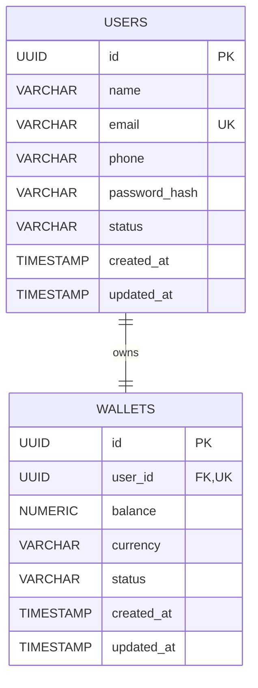

# LedgerFlow Architecture

## Current Domain Model

```text
User                         Wallet
----                         ------
id: UUID                     id: UUID
name: String                 balance: NUMERIC(19,2)
email: String (unique)       currency: INR
phone: String?               status: WalletStatus
passwordHash: String         createdAt: Instant
status: UserStatus           updatedAt: Instant
createdAt: Instant
updatedAt: Instant

User 1  <----------------->  1 Wallet
          wallets.user_id
          NOT NULL, UNIQUE, FK -> users.id
```

The relationship is bidirectional in Java. `Wallet` owns it and stores the foreign key, so the unique constraint prevents multiple wallet rows from referencing one user. `User.assignWallet(...)` sets both sides of the association. UUIDs are generated by JPA; timestamps are populated by Spring Data JPA auditing.

## ER Diagram


