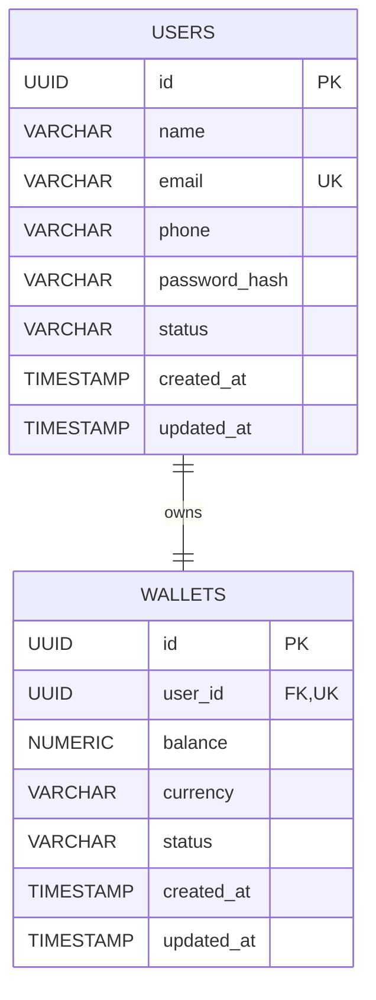

# LedgerFlow Architecture

## Authentication Architecture

### Registration

```text
                    ┌─────────────────────┐
                    │       Client        │
                    │ Postman / Frontend  │
                    └──────────┬──────────┘
                               │ HTTP request
                               ▼
                    ┌─────────────────────┐
                    │     Controller      │
                    │  AuthController     │
                    └──────────┬──────────┘
                               │ DTO
                               ▼
                    ┌─────────────────────┐
                    │      Service        │
                    │   AuthService       │
                    └───────┬─────┬───────┘
                            │     │
                  ┌─────────┘     └──────────┐
                  ▼                          ▼
        ┌──────────────────┐       ┌─────────────────┐
        │ UserRepository   │       │ PasswordEncoder │
        └────────┬─────────┘       └─────────────────┘
                 │
                 ▼
        ┌──────────────────┐
        │    PostgreSQL    │
        │ User + Wallet    │
        └──────────────────┘
```

`AuthService.register` is the transaction boundary: the user and its initial wallet are saved together, or the complete operation is rolled back. Controllers only translate HTTP requests into validated DTOs and delegate business work to services.

### Login and authenticated requests

```text
Client (email + password) → AuthController → AuthService
                                      ├── UserRepository
                                      ├── PasswordEncoder
                                      └── JwtService → signed JWT

Client (Authorization: Bearer <JWT>) → Spring Security resource server
                                     → signature and expiry validation
                                     → SecurityContext authenticated principal
                                     → protected controller, e.g. GET /api/v1/users/me
```

JWT authentication is stateless: no server-side HTTP session is created. Spring Security's resource-server support performs bearer-token extraction and validation; LedgerFlow supplies the signing/verification configuration and does not maintain a custom JWT filter.

## Wallet Read Architecture

```text
Client
  │ Authorization: Bearer <JWT>
  ▼
Spring Security resource server
  │ authenticated Jwt principal (sub = user UUID)
  ▼
WalletController
  ▼
WalletService
  ▼
WalletRepository
  ▼
Wallet / PostgreSQL
```

The controller extracts only the trusted JWT subject and passes it to `WalletService`. It never accepts a client-supplied wallet or user identifier, and never accesses a repository or changes a balance. `WalletService` uses `findByUserId` to retrieve the wallet for that authenticated user before mapping it to an API DTO. This repository predicate is the ownership guarantee: a request authenticated as User A can retrieve only a wallet whose stored `user_id` is User A's ID.

## Current Domain Model

```text
User                         Wallet
----                         ------
id: UUID                     id: UUID
name: String                 balance: NUMERIC(19,2)
email: String (unique)       currency: INR
phone: String?               status: WalletStatus
passwordHash: String         createdAt: Instant
status: UserStatus           updatedAt: Instant
createdAt: Instant
updatedAt: Instant

User 1  <----------------->  1 Wallet
          wallets.user_id
          NOT NULL, UNIQUE, FK -> users.id
```

The relationship is bidirectional in Java. `Wallet` owns it and stores the foreign key, so the unique constraint prevents multiple wallet rows from referencing one user. `User.assignWallet(...)` sets both sides of the association. UUIDs are generated by JPA; timestamps are populated by Spring Data JPA auditing.

## ER Diagram


